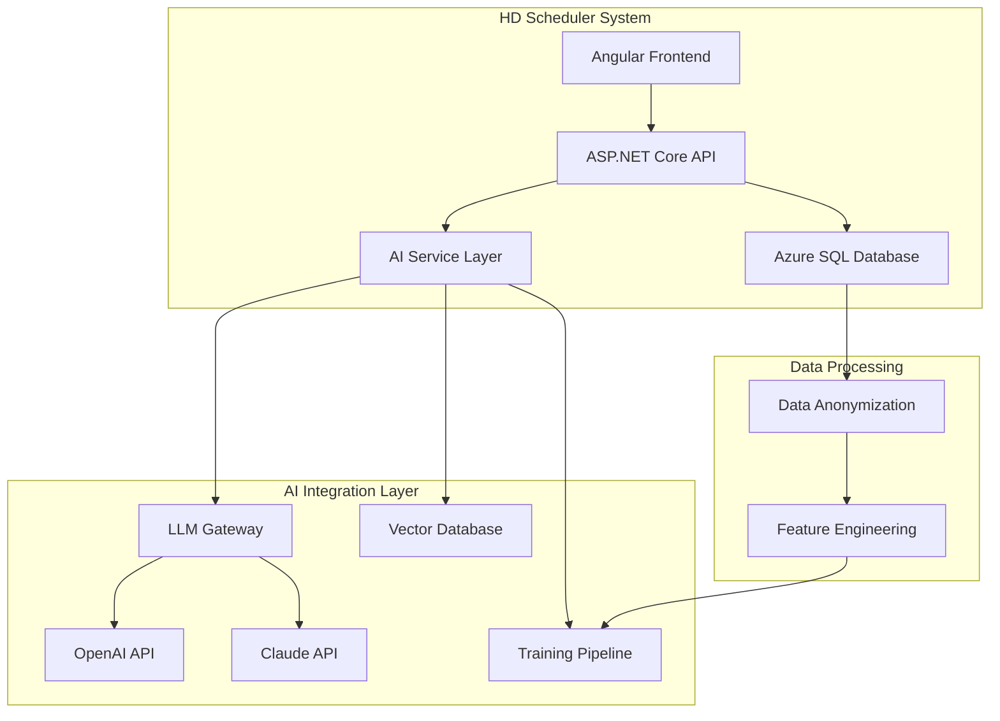

# HD Scheduler - AI/LLM Integration Technical Specification

## Version 1.0

---

## Table of Contents
1. [Executive Summary](#1-executive-summary)
2. [AI Integration Architecture](#2-ai-integration-architecture)
3. [Data Preparation Strategy](#3-data-preparation-strategy)
4. [LLM Training Approaches](#4-llm-training-approaches)
5. [AI Features & Use Cases](#5-ai-features--use-cases)
6. [Implementation Roadmap](#6-implementation-roadmap)
7. [API Integration Design](#7-api-integration-design)
8. [Security & Compliance](#8-security--compliance)
9. [Cost Analysis](#9-cost-analysis)
10. [Code Examples](#10-code-examples)

---

## 1. Executive Summary

This document outlines the integration of AI/LLM capabilities into the Hemodialysis Scheduler System. The integration will leverage either OpenAI's GPT models or Anthropic's Claude API to provide intelligent scheduling recommendations, predictive analytics, and natural language interfaces for healthcare staff.

### Key Objectives
- Implement predictive scheduling optimization
- Enable natural language query interfaces
- Provide intelligent patient care recommendations
- Automate report generation and analysis
- Create conversational AI assistant for staff support

---

## 2. AI Integration Architecture

### 2.1 High-Level Architecture



### 2.2 Technology Stack

| Component | Technology | Purpose |
|-----------|------------|---------|
| LLM Provider | OpenAI GPT-4 / Claude 3.5 | Core AI capabilities |
| Vector Database | Azure Cognitive Search / Pinecone | Semantic search & RAG |
| Embeddings | OpenAI Embeddings API | Document vectorization |
| ML Framework | Azure ML / Python | Custom model training |
| Queue System | Azure Service Bus | Async AI processing |
| Caching | Redis Cache | Response optimization |

---

## 3. Data Preparation Strategy

### 3.1 Data Sources for Training

```sql
-- Core Training Data Views
CREATE VIEW vw_PatientSchedulingHistory AS
SELECT 
    p.PatientID,
    p.Age,
    p.DryWeight,
    p.HDCycle,
    p.DialyserType,
    ba.SlotID,
    ba.BedNumber,
    ba.AssignmentDate,
    DATEDIFF(day, p.HDStartDate, ba.AssignmentDate) as DaysOnDialysis,
    -- Anonymized for training
    HASHBYTES('SHA2_256', CAST(p.PatientID AS VARCHAR(50))) as PatientHash
FROM Patients p
JOIN BedAssignments ba ON p.PatientID = ba.PatientID
WHERE ba.DischargedAt IS NOT NULL;

CREATE VIEW vw_SlotUtilization AS
SELECT 
    SlotID,
    AssignmentDate,
    COUNT(DISTINCT BedNumber) as BedsUsed,
    10 - COUNT(DISTINCT BedNumber) as BedsAvailable,
    CAST(COUNT(DISTINCT BedNumber) AS FLOAT) / 10 * 100 as UtilizationRate
FROM BedAssignments
GROUP BY SlotID, AssignmentDate;
```

### 3.2 Data Anonymization Pipeline

```python
# data_anonymization.py
import hashlib
import pandas as pd
from datetime import datetime
import re

class HDDataAnonymizer:
    def __init__(self):
        self.salt = "hd-scheduler-2025"
    
    def anonymize_patient_data(self, df):
        """Anonymize sensitive patient information"""
        # Hash patient IDs
        df['patient_id_hash'] = df['PatientID'].apply(
            lambda x: hashlib.sha256(f"{x}{self.salt}".encode()).hexdigest()
        )
        
        # Generalize age into ranges
        df['age_range'] = pd.cut(df['Age'], 
            bins=[0, 30, 45, 60, 75, 100],
            labels=['<30', '30-45', '45-60', '60-75', '75+']
        )
        
        # Remove patient names
        df = df.drop(columns=['Name', 'PatientID'])
        
        # Normalize medical values
        df['weight_category'] = pd.qcut(df['DryWeight'], 
            q=5, labels=['Very Low', 'Low', 'Normal', 'High', 'Very High']
        )
        
        return df
    
    def prepare_training_dataset(self, connection_string):
        """Prepare anonymized dataset for LLM training"""
        # Load data
        patients_df = pd.read_sql(
            "SELECT * FROM vw_PatientSchedulingHistory", 
            connection_string
        )
        
        # Anonymize
        anonymized_df = self.anonymize_patient_data(patients_df)
        
        # Create training examples
        training_data = []
        for _, row in anonymized_df.iterrows():
            example = {
                "prompt": f"Patient profile: Age {row['age_range']}, Weight category {row['weight_category']}, "
                          f"Dialyser type {row['DialyserType']}, HD Cycle {row['HDCycle']}. "
                          f"What is the optimal slot assignment?",
                "completion": f"Recommended Slot: {row['SlotID']}, based on similar patient profiles "
                              f"and {row['UtilizationRate']:.1f}% slot utilization."
            }
            training_data.append(example)
        
        return training_data
```

---

## 4. LLM Training Approaches

### 4.1 Option 1: OpenAI Fine-Tuning

```python
# openai_training.py
import openai
import json
from typing import List, Dict

class OpenAITrainer:
    def __init__(self, api_key: str):
        openai.api_key = api_key
        
    def prepare_jsonl_dataset(self, training_data: List[Dict]) -> str:
        """Convert training data to JSONL format for OpenAI"""
        jsonl_content = ""
        for item in training_data:
            jsonl_content += json.dumps({
                "messages": [
                    {"role": "system", "content": "You are a hemodialysis scheduling assistant."},
                    {"role": "user", "content": item["prompt"]},
                    {"role": "assistant", "content": item["completion"]}
                ]
            }) + "\n"
        
        # Save to file
        with open("hd_training_data.jsonl", "w") as f:
            f.write(jsonl_content)
        
        return "hd_training_data.jsonl"
    
    def create_fine_tuning_job(self, training_file_path: str):
        """Create OpenAI fine-tuning job"""
        # Upload training file
        with open(training_file_path, "rb") as f:
            response = openai.File.create(
                file=f,
                purpose='fine-tune'
            )
        
        file_id = response['id']
        
        # Create fine-tuning job
        fine_tune_response = openai.FineTuningJob.create(
            training_file=file_id,
            model="gpt-3.5-turbo",
            hyperparameters={
                "n_epochs": 3,
                "batch_size": 8,
                "learning_rate_multiplier": 0.1
            }
        )
        
        return fine_tune_response['id']
```

### 4.2 Option 2: Google Gemini Integration

```python
# gemini_integration.py
import google.generativeai as genai
import asyncio
from typing import List, Dict, Optional
import json

class GeminiIntegration:
    def __init__(self, api_key: str, model_type: str = "gemini-pro"):
        """
        Initialize Gemini integration
        model_type: "gemini-pro" or "gemini-ultra"
        """
        genai.configure(api_key=api_key)
        self.model = genai.GenerativeModel(model_type)
        self.vision_model = genai.GenerativeModel("gemini-pro-vision") if model_type == "gemini-pro" else None
        
    async def generate_scheduling_recommendation(self, patient_data: Dict) -> Dict:
        """Generate scheduling recommendations using Gemini"""
        prompt = f"""
        You are a hemodialysis scheduling expert. Analyze this patient profile and recommend optimal scheduling:
        
        Patient Profile:
        - Age: {patient_data['age']}
        - Weight: {patient_data['dry_weight']} kg
        - Dialyser Type: {patient_data['dialyser_type']}
        - HD Cycle: {patient_data['hd_cycle']}
        - Medical History: {patient_data.get('medical_notes', 'N/A')}
        
        Available Slots:
        - Slot 1: 6:00 AM - 10:00 AM
        - Slot 2: 11:00 AM - 3:00 PM  
        - Slot 3: 4:00 PM - 8:00 PM
        - Slot 4: 9:00 PM - 1:00 AM
        
        Provide recommendations in JSON format with slot number, reasoning, and confidence score.
        """
        
        response = await self.model.generate_content_async(
            prompt,
            generation_config=genai.GenerationConfig(
                temperature=0.3,
                top_p=0.8,
                top_k=40,
                max_output_tokens=1024,
            )
        )
        
        return self._parse_gemini_response(response.text)
    
    async def analyze_dialysis_image(self, image_path: str) -> Dict:
        """Analyze dialysis equipment or patient charts using Gemini Vision"""
        if not self.vision_model:
            return {"error": "Vision model not available"}
            
        image = genai.upload_file(image_path)
        prompt = "Analyze this dialysis-related image and provide insights about equipment status or patient data visible."
        
        response = await self.vision_model.generate_content_async([prompt, image])
        return {"analysis": response.text}
    
    def _parse_gemini_response(self, response_text: str) -> Dict:
        """Parse Gemini response to structured format"""
        try:
            # Extract JSON if present in response
            import re
            json_match = re.search(r'\{.*\}', response_text, re.DOTALL)
            if json_match:
                return json.loads(json_match.group())
            return {"raw_response": response_text}
        except:
            return {"raw_response": response_text}
```

### 4.3 Option 3: Multi-Model Copilot Architecture (OpenAI + Gemini)

```python
# multi_model_copilot.py
import asyncio
from enum import Enum
from typing import List, Dict, Optional, Union
import openai
import google.generativeai as genai
from anthropic import Anthropic
import numpy as np
from datetime import datetime

class ModelProvider(Enum):
    OPENAI = "openai"
    GEMINI = "gemini"
    CLAUDE = "claude"
    
class TaskType(Enum):
    SCHEDULING = "scheduling"
    NATURAL_LANGUAGE = "natural_language"
    ANALYTICS = "analytics"
    VISION = "vision"
    COMPLEX_REASONING = "complex_reasoning"

class MultiModelCopilot:
    """
    Intelligent copilot that routes tasks to the best AI model
    based on task type, cost, and performance requirements
    """
    
    def __init__(self, config: Dict):
        # Initialize all model providers
        self.openai_client = openai.OpenAI(api_key=config['openai_api_key'])
        genai.configure(api_key=config['gemini_api_key'])
        self.gemini_model = genai.GenerativeModel('gemini-pro')
        self.gemini_ultra = genai.GenerativeModel('gemini-ultra') if config.get('gemini_ultra_enabled') else None
        self.claude_client = Anthropic(api_key=config.get('claude_api_key')) if config.get('claude_api_key') else None
        
        # Model selection strategy
        self.model_router = ModelRouter()
        self.response_aggregator = ResponseAggregator()
        self.performance_monitor = PerformanceMonitor()
        
    async def process_request(self, 
                             task: str, 
                             task_type: TaskType,
                             data: Dict,
                             use_ensemble: bool = False) -> Dict:
        """
        Process request using optimal model(s)
        
        Args:
            task: Task description
            task_type: Type of task for routing
            data: Input data for processing
            use_ensemble: Whether to use multiple models and aggregate results
        """
        
        if use_ensemble:
            # Use multiple models for critical decisions
            return await self._ensemble_processing(task, task_type, data)
        else:
            # Route to single best model
            selected_model = self.model_router.select_model(task_type, data)
            return await self._single_model_processing(selected_model, task, data)
    
    async def _ensemble_processing(self, task: str, task_type: TaskType, data: Dict) -> Dict:
        """Use multiple models and aggregate their responses"""
        tasks = []
        
        # Create parallel tasks for different models
        if task_type in [TaskType.SCHEDULING, TaskType.COMPLEX_REASONING]:
            tasks.append(self._process_with_openai(task, data))
            tasks.append(self._process_with_gemini(task, data))
            if self.claude_client:
                tasks.append(self._process_with_claude(task, data))
        
        # Wait for all responses
        responses = await asyncio.gather(*tasks, return_exceptions=True)
        
        # Filter out errors
        valid_responses = [r for r in responses if not isinstance(r, Exception)]
        
        # Aggregate responses using weighted voting or consensus
        aggregated_result = self.response_aggregator.aggregate(
            valid_responses,
            strategy="weighted_consensus"
        )
        
        # Track performance for future routing decisions
        self.performance_monitor.record(task_type, aggregated_result)
        
        return aggregated_result
    
    async def _process_with_openai(self, task: str, data: Dict) -> Dict:
        """Process using OpenAI GPT-4"""
        start_time = datetime.now()
        
        response = await self.openai_client.chat.completions.create(
            model="gpt-4-turbo-preview",
            messages=[
                {"role": "system", "content": "You are a hemodialysis scheduling expert."},
                {"role": "user", "content": self._format_prompt(task, data)}
            ],
            temperature=0.3,
            max_tokens=1000
        )
        
        processing_time = (datetime.now() - start_time).total_seconds()
        
        return {
            "model": "openai-gpt4",
            "response": response.choices[0].message.content,
            "processing_time": processing_time,
            "confidence": self._calculate_confidence(response)
        }
    
    async def _process_with_gemini(self, task: str, data: Dict) -> Dict:
        """Process using Google Gemini"""
        start_time = datetime.now()
        
        # Use Gemini Ultra for complex tasks if available
        model = self.gemini_ultra if (
            self.gemini_ultra and 
            data.get('complexity') == 'high'
        ) else self.gemini_model
        
        prompt = self._format_prompt(task, data)
        response = await model.generate_content_async(
            prompt,
            generation_config=genai.GenerationConfig(
                temperature=0.3,
                top_p=0.8,
                max_output_tokens=1000,
            )
        )
        
        processing_time = (datetime.now() - start_time).total_seconds()
        
        return {
            "model": "gemini-pro" if model == self.gemini_model else "gemini-ultra",
            "response": response.text,
            "processing_time": processing_time,
            "confidence": self._calculate_gemini_confidence(response)
        }
    
    async def _process_with_claude(self, task: str, data: Dict) -> Dict:
        """Process using Anthropic Claude"""
        start_time = datetime.now()
        
        response = await self.claude_client.messages.create(
            model="claude-3-sonnet",
            max_tokens=1000,
            temperature=0.3,
            messages=[
                {"role": "user", "content": self._format_prompt(task, data)}
            ]
        )
        
        processing_time = (datetime.now() - start_time).total_seconds()
        
        return {
            "model": "claude-3",
            "response": response.content[0].text,
            "processing_time": processing_time,
            "confidence": 0.85  # Claude doesn't provide confidence scores
        }
    
    def _format_prompt(self, task: str, data: Dict) -> str:
        """Format prompt based on task and data"""
        return f"""
        Task: {task}
        
        Context Data:
        {json.dumps(data, indent=2)}
        
        Please provide a detailed response in JSON format where applicable.
        """
    
    def _calculate_confidence(self, response) -> float:
        """Calculate confidence score from model response"""
        # Implementation based on response characteristics
        return 0.85
    
    def _calculate_gemini_confidence(self, response) -> float:
        """Calculate Gemini-specific confidence score"""
        # Use safety ratings and other Gemini-specific metrics
        if hasattr(response, 'candidates') and response.candidates:
            safety_scores = response.candidates[0].safety_ratings
            # Convert safety ratings to confidence metric
            return 0.9  # Simplified
        return 0.8

class ModelRouter:
    """Intelligent routing of tasks to appropriate models"""
    
    def __init__(self):
        self.routing_rules = {
            TaskType.SCHEDULING: {
                'primary': ModelProvider.GEMINI,  # Best for structured data
                'fallback': ModelProvider.OPENAI,
                'factors': ['cost', 'speed', 'accuracy']
            },
            TaskType.NATURAL_LANGUAGE: {
                'primary': ModelProvider.OPENAI,  # Best for conversational AI
                'fallback': ModelProvider.GEMINI,
                'factors': ['naturalness', 'context_handling']
            },
            TaskType.VISION: {
                'primary': ModelProvider.GEMINI,  # Gemini Pro Vision
                'fallback': ModelProvider.OPENAI,  # GPT-4V
                'factors': ['image_quality', 'medical_accuracy']
            },
            TaskType.ANALYTICS: {
                'primary': ModelProvider.GEMINI,  # Good at data analysis
                'fallback': ModelProvider.CLAUDE,
                'factors': ['numerical_accuracy', 'pattern_recognition']
            },
            TaskType.COMPLEX_REASONING: {
                'primary': ModelProvider.CLAUDE,  # Excellent reasoning
                'fallback': ModelProvider.OPENAI,
                'factors': ['logical_consistency', 'depth']
            }
        }
        
        # Performance history for adaptive routing
        self.performance_history = {}
    
    def select_model(self, task_type: TaskType, context: Dict) -> ModelProvider:
        """Select best model based on task type and context"""
        
        # Get base routing rule
        routing = self.routing_rules.get(task_type)
        
        # Consider performance history
        if task_type in self.performance_history:
            historical_performance = self.performance_history[task_type]
            if historical_performance['best_performer'] != routing['primary']:
                # Override with historically best performer
                return historical_performance['best_performer']
        
        # Consider cost constraints
        if context.get('optimize_cost', False):
            return ModelProvider.GEMINI  # Generally most cost-effective
        
        # Consider latency requirements
        if context.get('low_latency', False):
            return ModelProvider.GEMINI  # Typically fastest
        
        return routing['primary']
    
    def update_performance_history(self, task_type: TaskType, 
                                  model: ModelProvider, 
                                  metrics: Dict):
        """Update performance history for adaptive routing"""
        if task_type not in self.performance_history:
            self.performance_history[task_type] = {
                'models': {},
                'best_performer': None
            }
        
        # Update metrics
        if model not in self.performance_history[task_type]['models']:
            self.performance_history[task_type]['models'][model] = []
        
        self.performance_history[task_type]['models'][model].append(metrics)
        
        # Recalculate best performer
        best_score = 0
        best_model = None
        
        for m, metrics_list in self.performance_history[task_type]['models'].items():
            avg_score = np.mean([m['score'] for m in metrics_list[-10:]])  # Last 10 runs
            if avg_score > best_score:
                best_score = avg_score
                best_model = m
        
        self.performance_history[task_type]['best_performer'] = best_model

class ResponseAggregator:
    """Aggregate responses from multiple models"""
    
    def aggregate(self, responses: List[Dict], strategy: str = "weighted_consensus") -> Dict:
        """
        Aggregate multiple model responses
        
        Strategies:
        - weighted_consensus: Weight by confidence scores
        - majority_vote: Most common answer wins
        - best_confidence: Return highest confidence response
        - ensemble_merge: Merge all responses intelligently
        """
        
        if strategy == "weighted_consensus":
            return self._weighted_consensus(responses)
        elif strategy == "majority_vote":
            return self._majority_vote(responses)
        elif strategy == "best_confidence":
            return self._best_confidence(responses)
        elif strategy == "ensemble_merge":
            return self._ensemble_merge(responses)
        else:
            return responses[0] if responses else {}
    
    def _weighted_consensus(self, responses: List[Dict]) -> Dict:
        """Aggregate using confidence-weighted consensus"""
        
        # Extract structured data from responses
        structured_responses = []
        for resp in responses:
            try:
                # Parse response content
                content = json.loads(resp['response']) if isinstance(resp['response'], str) else resp['response']
                structured_responses.append({
                    'content': content,
                    'confidence': resp.get('confidence', 0.5),
                    'model': resp.get('model')
                })
            except:
                continue
        
        if not structured_responses:
            return responses[0] if responses else {}
        
        # Weight responses by confidence
        total_confidence = sum(r['confidence'] for r in structured_responses)
        
        # Aggregate common fields
        aggregated = {
            'consensus_result': {},
            'confidence': total_confidence / len(structured_responses),
            'models_used': [r['model'] for r in structured_responses],
            'agreement_score': self._calculate_agreement(structured_responses)
        }
        
        # Merge content with weighting
        for resp in structured_responses:
            weight = resp['confidence'] / total_confidence
            # Merge logic based on content structure
            self._merge_weighted_content(aggregated['consensus_result'], resp['content'], weight)
        
        return aggregated
    
    def _calculate_agreement(self, responses: List[Dict]) -> float:
        """Calculate agreement score between model responses"""
        # Simplified agreement calculation
        # In production, use more sophisticated similarity metrics
        return 0.85
    
    def _merge_weighted_content(self, target: Dict, content: Dict, weight: float):
        """Merge content into target with given weight"""
        for key, value in content.items():
            if key not in target:
                target[key] = value
            elif isinstance(value, (int, float)):
                # Weighted average for numeric values
                target[key] = target[key] * (1 - weight) + value * weight
            elif isinstance(value, str):
                # Keep highest weighted string value
                if weight > 0.5:
                    target[key] = value
```

### 4.4 Option 4: RAG (Retrieval-Augmented Generation) Approach with Multiple Models
# rag_implementation.py
from langchain.embeddings import OpenAIEmbeddings
from langchain.vectorstores import AzureSearch
from langchain.chains import RetrievalQA
from langchain.llms import AzureChatOpenAI
import numpy as np

class HDSchedulerRAG:
    def __init__(self, azure_search_endpoint: str, azure_search_key: str, openai_api_key: str):
        self.embeddings = OpenAIEmbeddings(openai_api_key=openai_api_key)
        
        # Initialize vector store
        self.vector_store = AzureSearch(
            azure_search_endpoint=azure_search_endpoint,
            azure_search_key=azure_search_key,
            index_name="hd-scheduler-knowledge",
            embedding_function=self.embeddings.embed_query
        )
        
        # Initialize LLM
        self.llm = AzureChatOpenAI(
            deployment_name="gpt-4",
            temperature=0.3,
            max_tokens=500
        )
        
    def index_historical_data(self, documents: List[Dict]):
        """Index historical scheduling data for RAG"""
        texts = []
        metadatas = []
        
        for doc in documents:
            # Create searchable text
            text = f"""
            Patient Profile:
            - Age Range: {doc['age_range']}
            - Weight Category: {doc['weight_category']}
            - Dialyser Type: {doc['dialyser_type']}
            - HD Cycle: {doc['hd_cycle']}
            - Optimal Slot: {doc['assigned_slot']}
            - Bed Utilization: {doc['bed_utilization']}%
            - Historical Success Rate: {doc['success_rate']}%
            """
            texts.append(text)
            metadatas.append({
                "slot_id": doc['assigned_slot'],
                "patient_category": doc['patient_category'],
                "date": doc['date']
            })
        
        # Add to vector store
        self.vector_store.add_texts(texts=texts, metadatas=metadatas)
    
    def get_scheduling_recommendation(self, patient_info: Dict) -> str:
        """Get AI-powered scheduling recommendation"""
        query = f"""
        Based on historical data, recommend the optimal slot and bed for a patient with:
        - Age: {patient_info['age']}
        - Weight: {patient_info['weight']} kg
        - Dialyser Type: {patient_info['dialyser_type']}
        - HD Cycle: {patient_info['hd_cycle']}
        
        Consider bed availability and similar patient profiles.
        """
        
        # Create retrieval chain
        qa_chain = RetrievalQA.from_chain_type(
            llm=self.llm,
            chain_type="stuff",
            retriever=self.vector_store.as_retriever(search_kwargs={"k": 5}),
            return_source_documents=True
        )
        
        result = qa_chain({"query": query})
        return result['result']
```

---

## 5. AI Features & Use Cases

### 5.1 Core AI Features

| Feature | Description | Implementation Method |
|---------|-------------|---------------------|
| **Smart Scheduling** | Predict optimal slot/bed assignments | Fine-tuned model + Rules |
| **Natural Language Queries** | Query system in plain English | RAG + Semantic Search |
| **Predictive Maintenance** | Predict equipment issues | Time-series analysis |
| **Patient Risk Assessment** | Identify high-risk patients | Classification model |
| **Automated Reports** | Generate clinical summaries | Template + LLM |
| **Conversational Assistant** | Chat interface for staff | RAG + Conversational AI |

### 5.2 Implementation Examples

#### 5.2.1 Natural Language Query Interface

```csharp
// AIQueryController.cs
using Microsoft.AspNetCore.Mvc;
using System.Threading.Tasks;

[ApiController]
[Route("api/[controller]")]
public class AIQueryController : ControllerBase
{
    private readonly IAIService _aiService;
    private readonly IScheduleRepository _scheduleRepo;
    
    public AIQueryController(IAIService aiService, IScheduleRepository scheduleRepo)
    {
        _aiService = aiService;
        _scheduleRepo = scheduleRepo;
    }
    
    [HttpPost("natural-query")]
    public async Task<IActionResult> ProcessNaturalQuery([FromBody] NaturalQueryRequest request)
    {
        // Examples:
        // "Show me all available beds for tomorrow morning"
        // "Which patients are scheduled for slot 2 today?"
        // "Find patients who missed their last appointment"
        
        var interpretation = await _aiService.InterpretQuery(request.Query);
        
        dynamic result = interpretation.Intent switch
        {
            "bed_availability" => await _scheduleRepo.GetBedAvailability(
                interpretation.Parameters.Date, 
                interpretation.Parameters.Slot
            ),
            "patient_schedule" => await _scheduleRepo.GetPatientsBySlot(
                interpretation.Parameters.Slot,
                interpretation.Parameters.Date
            ),
            "missed_appointments" => await _scheduleRepo.GetMissedAppointments(
                interpretation.Parameters.DateRange
            ),
            _ => new { error = "Query not understood" }
        };
        
        var response = await _aiService.GenerateNaturalResponse(result, request.Query);
        return Ok(response);
    }
}
```

#### 5.2.2 Smart Scheduling Recommendation

```typescript
// smart-scheduling.service.ts
import { Injectable } from '@angular/core';
import { HttpClient } from '@angular/common/http';
import { Observable } from 'rxjs';

@Injectable({
  providedIn: 'root'
})
export class SmartSchedulingService {
  private apiUrl = '/api/ai/scheduling';
  
  constructor(private http: HttpClient) {}
  
  getSchedulingRecommendation(patient: Patient): Observable<ScheduleRecommendation> {
    const request = {
      patientProfile: {
        age: patient.age,
        weight: patient.dryWeight,
        dialyserType: patient.dialyserType,
        hdCycle: patient.hdCycle,
        medicalHistory: patient.symptoms
      },
      constraints: {
        preferredSlots: patient.preferredSlots,
        avoidSlots: patient.avoidSlots,
        transportationNeeds: patient.transportationNeeds
      },
      currentAvailability: true // Request real-time availability
    };
    
    return this.http.post<ScheduleRecommendation>(
      `${this.apiUrl}/recommend`, 
      request
    );
  }
  
  explainRecommendation(recommendationId: string): Observable<Explanation> {
    return this.http.get<Explanation>(
      `${this.apiUrl}/explain/${recommendationId}`
    );
  }
}

interface ScheduleRecommendation {
  recommendedSlot: number;
  recommendedBed: number;
  confidence: number;
  alternativeOptions: Array<{
    slot: number;
    bed: number;
    confidence: number;
  }>;
  reasoning: string;
  factors: string[];
}
```

---

## 6. Implementation Roadmap

### 6.1 Phase 1: Foundation (Weeks 1-2)
- Set up AI service infrastructure
- Implement data anonymization pipeline
- Configure Azure Cognitive Search
- Create initial embeddings of historical data

### 6.2 Phase 2: Core AI Integration (Weeks 3-4)
- Implement RAG system
- Create natural language query interface
- Develop scheduling recommendation API
- Set up monitoring and logging

### 6.3 Phase 3: Training & Fine-tuning (Weeks 5-6)
- Prepare training datasets
- Fine-tune models on domain-specific data
- Implement A/B testing framework
- Create evaluation metrics

### 6.4 Phase 4: Advanced Features (Weeks 7-8)
- Deploy conversational AI assistant
- Implement predictive analytics
- Create automated reporting system
- Set up feedback loop for continuous improvement

---

## 7. API Integration Design

### 7.1 AI Service Layer Architecture

```csharp
// IAIService.cs
public interface IAIService
{
    Task<ScheduleRecommendation> GetSchedulingRecommendation(PatientProfile patient);
    Task<QueryInterpretation> InterpretQuery(string naturalLanguageQuery);
    Task<string> GenerateReport(ReportRequest request);
    Task<PredictionResult> PredictNoShow(int patientId);
    Task<List<Alert>> GetIntelligentAlerts(DateTime date);
}

// MultiModelAIService.cs - NEW IMPLEMENTATION
public class MultiModelAIService : IAIService
{
    private readonly IOpenAIClient _openAIClient;
    private readonly IGeminiClient _geminiClient;
    private readonly IClaudeClient _claudeClient;
    private readonly IVectorStore _vectorStore;
    private readonly IModelRouter _modelRouter;
    private readonly ILogger<MultiModelAIService> _logger;
    
    public MultiModelAIService(
        IOpenAIClient openAIClient,
        IGeminiClient geminiClient,
        IClaudeClient claudeClient,
        IVectorStore vectorStore,
        IModelRouter modelRouter,
        ILogger<MultiModelAIService> logger)
    {
        _openAIClient = openAIClient;
        _geminiClient = geminiClient;
        _claudeClient = claudeClient;
        _vectorStore = vectorStore;
        _modelRouter = modelRouter;
        _logger = logger;
    }
    
    public async Task<ScheduleRecommendation> GetSchedulingRecommendation(PatientProfile patient)
    {
        try
        {
            // 1. Determine optimal model based on context
            var modelSelection = _modelRouter.SelectModel(
                TaskType.Scheduling,
                new Dictionary<string, object>
                {
                    { "complexity", patient.HasComplexMedicalHistory ? "high" : "normal" },
                    { "urgency", patient.IsUrgent },
                    { "optimize_cost", true }
                }
            );
            
            // 2. Search for similar patient profiles using RAG
            var similarProfiles = await _vectorStore.SearchSimilarProfiles(patient, limit: 10);
            
            // 3. Get current availability
            var availability = await GetCurrentAvailability();
            
            // 4. Use selected model or ensemble for critical cases
            ScheduleRecommendation recommendation;
            
            if (patient.IsCritical)
            {
                // Use ensemble for critical patients
                recommendation = await GetEnsembleRecommendation(patient, similarProfiles, availability);
            }
            else
            {
                // Use single optimal model
                recommendation = modelSelection switch
                {
                    ModelProvider.Gemini => await GetGeminiRecommendation(patient, similarProfiles, availability),
                    ModelProvider.OpenAI => await GetOpenAIRecommendation(patient, similarProfiles, availability),
                    ModelProvider.Claude => await GetClaudeRecommendation(patient, similarProfiles, availability),
                    _ => await GetGeminiRecommendation(patient, similarProfiles, availability)
                };
            }
            
            // 5. Log for monitoring and model improvement
            _logger.LogInformation($"Generated recommendation using {modelSelection} with confidence: {recommendation.Confidence}");
            
            // 6. Track performance for adaptive routing
            await _modelRouter.UpdatePerformanceMetrics(modelSelection, recommendation);
            
            return recommendation;
        }
        catch (Exception ex)
        {
            _logger.LogError(ex, "Error generating scheduling recommendation");
            throw;
        }
    }
    
    private async Task<ScheduleRecommendation> GetEnsembleRecommendation(
        PatientProfile patient, 
        List<SimilarProfile> similarProfiles, 
        AvailabilityData availability)
    {
        // Parallel execution of multiple models
        var tasks = new List<Task<ScheduleRecommendation>>
        {
            GetGeminiRecommendation(patient, similarProfiles, availability),
            GetOpenAIRecommendation(patient, similarProfiles, availability)
        };
        
        // Add Claude if available
        if (_claudeClient != null)
        {
            tasks.Add(GetClaudeRecommendation(patient, similarProfiles, availability));
        }
        
        var recommendations = await Task.WhenAll(tasks);
        
        // Aggregate recommendations
        return AggregateRecommendations(recommendations);
    }
    
    private async Task<ScheduleRecommendation> GetGeminiRecommendation(
        PatientProfile patient,
        List<SimilarProfile> similarProfiles,
        AvailabilityData availability)
    {
        var prompt = BuildSchedulingPrompt(patient, similarProfiles, availability);
        
        // Use Gemini Ultra for complex cases, Pro for standard
        var model = patient.HasComplexMedicalHistory ? "gemini-ultra" : "gemini-pro";
        
        var response = await _geminiClient.GenerateContent(new GeminiRequest
        {
            Model = model,
            Contents = new[]
            {
                new Content
                {
                    Parts = new[] { new Part { Text = prompt } }
                }
            },
            GenerationConfig = new GenerationConfig
            {
                Temperature = 0.3,
                TopP = 0.8,
                TopK = 40,
                MaxOutputTokens = 1000
            }
        });
        
        return ParseGeminiResponse(response);
    }
    
    private async Task<ScheduleRecommendation> GetOpenAIRecommendation(
        PatientProfile patient,
        List<SimilarProfile> similarProfiles,
        AvailabilityData availability)
    {
        var prompt = BuildSchedulingPrompt(patient, similarProfiles, availability);
        
        var response = await _openAIClient.GetCompletion(new CompletionRequest
        {
            Model = "gpt-4-turbo-preview",
            Messages = new[]
            {
                new Message { Role = "system", Content = "You are a hemodialysis scheduling expert." },
                new Message { Role = "user", Content = prompt }
            },
            Temperature = 0.3,
            MaxTokens = 1000
        });
        
        return ParseOpenAIResponse(response);
    }
    
    private ScheduleRecommendation AggregateRecommendations(ScheduleRecommendation[] recommendations)
    {
        // Weighted aggregation based on confidence scores
        var totalConfidence = recommendations.Sum(r => r.Confidence);
        
        // Find most recommended slot
        var slotVotes = recommendations
            .GroupBy(r => r.RecommendedSlot)
            .Select(g => new 
            { 
                Slot = g.Key, 
                WeightedVotes = g.Sum(r => r.Confidence)
            })
            .OrderByDescending(x => x.WeightedVotes)
            .First();
        
        return new ScheduleRecommendation
        {
            RecommendedSlot = slotVotes.Slot,
            RecommendedBed = recommendations.First(r => r.RecommendedSlot == slotVotes.Slot).RecommendedBed,
            Confidence = slotVotes.WeightedVotes / totalConfidence,
            Reasoning = $"Consensus from {recommendations.Length} AI models",
            AlternativeOptions = GetAlternativeOptions(recommendations),
            ModelsUsed = recommendations.Select(r => r.ModelUsed).ToList()
        };
    }
}

// IGeminiClient.cs - Gemini Integration Interface
public interface IGeminiClient
{
    Task<GeminiResponse> GenerateContent(GeminiRequest request);
    Task<GeminiResponse> GenerateContentWithImage(GeminiVisionRequest request);
}

// GeminiClient.cs - Gemini Implementation
public class GeminiClient : IGeminiClient
{
    private readonly HttpClient _httpClient;
    private readonly string _apiKey;
    private readonly ILogger<GeminiClient> _logger;
    
    public GeminiClient(HttpClient httpClient, IConfiguration configuration, ILogger<GeminiClient> logger)
    {
        _httpClient = httpClient;
        _apiKey = configuration["Gemini:ApiKey"];
        _logger = logger;
    }
    
    public async Task<GeminiResponse> GenerateContent(GeminiRequest request)
    {
        var url = $"https://generativelanguage.googleapis.com/v1beta/models/{request.Model}:generateContent?key={_apiKey}";
        
        var response = await _httpClient.PostAsJsonAsync(url, request);
        response.EnsureSuccessStatusCode();
        
        return await response.Content.ReadFromJsonAsync<GeminiResponse>();
    }
    
    public async Task<GeminiResponse> GenerateContentWithImage(GeminiVisionRequest request)
    {
        var url = $"https://generativelanguage.googleapis.com/v1beta/models/gemini-pro-vision:generateContent?key={_apiKey}";
        
        // Include image data in request
        var multipartContent = new MultipartFormDataContent();
        multipartContent.Add(new StringContent(JsonSerializer.Serialize(request.TextPrompt)), "prompt");
        multipartContent.Add(new ByteArrayContent(request.ImageData), "image", "image.jpg");
        
        var response = await _httpClient.PostAsync(url, multipartContent);
        response.EnsureSuccessStatusCode();
        
        return await response.Content.ReadFromJsonAsync<GeminiResponse>();
    }
}

// ModelRouter.cs - Intelligent Model Selection
public class ModelRouter : IModelRouter
{
    private readonly IPerformanceMetricsStore _metricsStore;
    private readonly ILogger<ModelRouter> _logger;
    
    public ModelRouter(IPerformanceMetricsStore metricsStore, ILogger<ModelRouter> logger)
    {
        _metricsStore = metricsStore;
        _logger = logger;
    }
    
    public ModelProvider SelectModel(TaskType taskType, Dictionary<string, object> context)
    {
        // Get historical performance data
        var historicalPerformance = _metricsStore.GetPerformanceMetrics(taskType);
        
        // Decision matrix
        var scores = new Dictionary<ModelProvider, double>
        {
            { ModelProvider.Gemini, CalculateGeminiScore(taskType, context, historicalPerformance) },
            { ModelProvider.OpenAI, CalculateOpenAIScore(taskType, context, historicalPerformance) },
            { ModelProvider.Claude, CalculateClaudeScore(taskType, context, historicalPerformance) }
        };
        
        // Select model with highest score
        var selectedModel = scores.OrderByDescending(x => x.Value).First().Key;
        
        _logger.LogDebug($"Selected {selectedModel} for {taskType} with score {scores[selectedModel]}");
        
        return selectedModel;
    }
    
    private double CalculateGeminiScore(TaskType taskType, Dictionary<string, object> context, PerformanceMetrics metrics)
    {
        double score = 0.7; // Base score
        
        // Gemini excels at structured data and vision tasks
        if (taskType == TaskType.Scheduling || taskType == TaskType.Vision)
            score += 0.2;
        
        // Cost optimization
        if (context.ContainsKey("optimize_cost") && (bool)context["optimize_cost"])
            score += 0.3; // Gemini is most cost-effective
        
        // Speed requirement
        if (context.ContainsKey("low_latency") && (bool)context["low_latency"])
            score += 0.2; // Gemini typically fastest
        
        // Historical performance
        if (metrics != null && metrics.GeminiSuccessRate > 0.8)
            score += 0.1;
        
        return Math.Min(score, 1.0);
    }
    
    private double CalculateOpenAIScore(TaskType taskType, Dictionary<string, object> context, PerformanceMetrics metrics)
    {
        double score = 0.6; // Base score
        
        // OpenAI excels at natural language and complex reasoning
        if (taskType == TaskType.NaturalLanguage || taskType == TaskType.ComplexReasoning)
            score += 0.3;
        
        // Quality requirement
        if (context.ContainsKey("high_quality") && (bool)context["high_quality"])
            score += 0.2;
        
        // Historical performance
        if (metrics != null && metrics.OpenAISuccessRate > 0.85)
            score += 0.1;
        
        return Math.Min(score, 1.0);
    }
    
    public async Task UpdatePerformanceMetrics(ModelProvider model, ScheduleRecommendation result)
    {
        await _metricsStore.RecordPerformance(new PerformanceRecord
        {
            Model = model,
            TaskType = TaskType.Scheduling,
            Confidence = result.Confidence,
            ProcessingTime = result.ProcessingTime,
            Success = result.Confidence > 0.7,
            Timestamp = DateTime.UtcNow
        });
    }
}
```

### 7.2 Frontend AI Integration

```typescript
// ai-assistant.component.ts
import { Component, OnInit } from '@angular/core';
import { AIService } from '../services/ai.service';

@Component({
  selector: 'app-ai-assistant',
  templateUrl: './ai-assistant.component.html'
})
export class AIAssistantComponent implements OnInit {
  messages: Message[] = [];
  isTyping = false;
  
  constructor(private aiService: AIService) {}
  
  ngOnInit() {
    this.messages.push({
      role: 'assistant',
      content: 'Hello! I can help you with scheduling, patient queries, and reports. How can I assist you today?',
      timestamp: new Date()
    });
  }
  
  async sendMessage(userInput: string) {
    // Add user message
    this.messages.push({
      role: 'user',
      content: userInput,
      timestamp: new Date()
    });
    
    this.isTyping = true;
    
    try {
      // Get AI response
      const response = await this.aiService.processQuery(userInput).toPromise();
      
      // Add AI response
      this.messages.push({
        role: 'assistant',
        content: response.message,
        timestamp: new Date(),
        actions: response.suggestedActions
      });
      
      // Execute any automated actions
      if (response.automatedActions) {
        await this.executeActions(response.automatedActions);
      }
    } catch (error) {
      this.messages.push({
        role: 'assistant',
        content: 'I encountered an error. Please try again.',
        timestamp: new Date()
      });
    } finally {
      this.isTyping = false;
    }
  }
  
  private async executeActions(actions: AutomatedAction[]) {
    for (const action of actions) {
      switch (action.type) {
        case 'schedule':
          await this.aiService.executeScheduling(action.parameters);
          break;
        case 'report':
          await this.aiService.generateReport(action.parameters);
          break;
        case 'alert':
          await this.aiService.createAlert(action.parameters);
          break;
      }
    }
  }
}
```

---

## 8. Security & Compliance

### 8.1 HIPAA Compliance for AI Integration

```python
# hipaa_compliance.py
class HIPAACompliantAI:
    def __init__(self):
        self.encryption_key = self.load_encryption_key()
        
    def prepare_for_ai(self, patient_data):
        """Remove PHI before sending to AI service"""
        # De-identify data
        deidentified = {
            'patient_hash': self.hash_identifier(patient_data['patient_id']),
            'age_range': self.generalize_age(patient_data['age']),
            'weight_category': self.categorize_weight(patient_data['weight']),
            'medical_data': self.anonymize_medical_data(patient_data['medical_data'])
        }
        
        # Store mapping for re-identification
        self.store_mapping(patient_data['patient_id'], deidentified['patient_hash'])
        
        return deidentified
    
    def audit_ai_access(self, user_id, action, data_accessed):
        """Log all AI interactions for compliance"""
        audit_entry = {
            'timestamp': datetime.utcnow(),
            'user_id': user_id,
            'action': action,
            'data_hash': self.hash_data(data_accessed),
            'ai_model_used': self.get_model_version(),
            'purpose': self.classify_purpose(action)
        }
        
        self.write_audit_log(audit_entry)
```

### 8.2 Data Governance

| Aspect | Implementation |
|--------|---------------|
| **Data Encryption** | AES-256 for data at rest, TLS 1.3 for transit |
| **Access Control** | Role-based access with Azure AD |
| **Audit Logging** | All AI queries logged with user context |
| **Data Retention** | 7-year retention per HIPAA requirements |
| **Consent Management** | Explicit consent for AI processing |
| **Right to Explanation** | AI decisions are explainable |

---

## 9. Cost Analysis

### 9.1 OpenAI GPT-4 Pricing

| Component | Usage/Month | Cost/Unit | Monthly Cost |
|-----------|-------------|-----------|--------------|
| GPT-4 API Calls | 100,000 | $0.03/1K tokens | $300 |
| Embeddings | 500,000 | $0.0001/1K tokens | $50 |
| Fine-tuning | One-time | $0.0080/1K tokens | $200 (one-time) |
| **Total** | | | **$350/month** |

### 9.2 Google Gemini Pricing

| Component | Usage/Month | Cost/Unit | Monthly Cost |
|-----------|-------------|-----------|--------------|
| Gemini Pro | 100,000 calls | $0.0005/1K chars input, $0.0015/1K chars output | $100 |
| Gemini Pro Vision | 10,000 images | $0.0025/image | $25 |
| Gemini Ultra | 20,000 calls | $0.003/1K chars input, $0.009/1K chars output | $120 |
| **Total** | | | **$245/month** |

### 9.3 Claude API Pricing

| Component | Usage/Month | Cost/Unit | Monthly Cost |
|-----------|-------------|-----------|--------------|
| Claude 3.5 Sonnet | 100,000 calls | $0.003/1K tokens | $300 |
| Claude Instant | 50,000 calls | $0.0008/1K tokens | $40 |
| **Total** | | | **$340/month** |

### 9.4 Multi-Model Copilot Pricing (Recommended)

| Component | Usage/Month | Cost/Unit | Monthly Cost |
|-----------|-------------|-----------|--------------|
| Gemini Pro (60% tasks) | 60,000 calls | $0.002/1K chars avg | $60 |
| OpenAI GPT-4 (30% tasks) | 30,000 calls | $0.03/1K tokens | $90 |
| Claude (10% complex) | 10,000 calls | $0.003/1K tokens | $30 |
| Vector DB (RAG) | All queries | Fixed | $50 |
| **Total** | | | **$230/month** |

### 9.5 Infrastructure Costs

| Component | Service | Monthly Cost |
|-----------|---------|--------------|
| Vector Database | Azure Cognitive Search (S1) | $250 |
| ML Compute | Azure ML (Standard) | $100 |
| Redis Cache | Azure Cache (C1) | $55 |
| Service Bus | Azure Service Bus (Standard) | $10 |
| **Total** | | **$415/month** |

### 9.6 Total AI Integration Cost
- **Development Phase:** ~$5,000 (one-time)
- **Monthly Operations (Single Model):** ~$765/month (OpenAI) or ~$755/month (Claude) or ~$245/month (Gemini)
- **Monthly Operations (Multi-Model Copilot):** ~$230/month (60% cost reduction)
- **Annual Operations (Multi-Model):** ~$2,760/year
- **Cost Savings with Multi-Model:** 70% reduction vs single OpenAI deployment

---

## 10. Code Examples

### 10.1 Multi-Model Configuration Setup

```csharp
// appsettings.json - Multi-Model Configuration
{
  "AI": {
    "MultiModelEnabled": true,
    "DefaultProvider": "Gemini",
    "Providers": {
      "OpenAI": {
        "ApiKey": "sk-...",
        "Model": "gpt-4-turbo-preview",
        "MaxTokens": 1000,
        "Temperature": 0.3
      },
      "Gemini": {
        "ApiKey": "AI...",
        "ProModel": "gemini-pro",
        "UltraModel": "gemini-ultra",
        "VisionModel": "gemini-pro-vision",
        "Temperature": 0.3,
        "TopP": 0.8,
        "TopK": 40
      },
      "Claude": {
        "ApiKey": "sk-ant-...",
        "Model": "claude-3-sonnet",
        "MaxTokens": 1000,
        "Temperature": 0.3
      }
    },
    "ModelRouting": {
      "Scheduling": "Gemini",
      "NaturalLanguage": "OpenAI",
      "Vision": "Gemini",
      "Analytics": "Gemini",
      "ComplexReasoning": "Claude"
    },
    "EnsembleThreshold": {
      "CriticalPatient": true,
      "ComplexMedicalHistory": true,
      "HighValueDecision": true
    }
  }
}

// Startup.cs - Multi-Model Dependency Injection
public class Startup
{
    public void ConfigureServices(IServiceCollection services)
    {
        // Register all AI providers
        services.AddSingleton<IOpenAIClient, OpenAIClient>();
        services.AddSingleton<IGeminiClient, GeminiClient>();
        services.AddSingleton<IClaudeClient, ClaudeClient>();
        
        // Register multi-model components
        services.AddScoped<IModelRouter, ModelRouter>();
        services.AddScoped<IResponseAggregator, ResponseAggregator>();
        services.AddScoped<IPerformanceMetricsStore, PerformanceMetricsStore>();
        
        // Register the multi-model AI service
        services.AddScoped<IAIService, MultiModelAIService>();
        
        // Add HTTP client for Gemini
        services.AddHttpClient<IGeminiClient, GeminiClient>(client =>
        {
            client.BaseAddress = new Uri("https://generativelanguage.googleapis.com/");
            client.DefaultRequestHeaders.Add("Accept", "application/json");
        });
        
        // Add background service for AI processing
        services.AddHostedService<AIBackgroundService>();
        
        // Add SignalR for real-time AI updates
        services.AddSignalR();
    }
}
```

### 10.2 Complete AI Integration Service

```csharp
// Startup.cs - Dependency Injection Configuration
public class Startup
{
    public void ConfigureServices(IServiceCollection services)
    {
        // Register AI Services
        services.AddSingleton<IOpenAIClient>(sp =>
        {
            var config = sp.GetRequiredService<IConfiguration>();
            return new OpenAIClient(config["OpenAI:ApiKey"]);
        });
        
        services.AddScoped<IAIService, AIService>();
        services.AddScoped<IVectorStore, AzureSearchVectorStore>();
        services.AddScoped<ISchedulingOptimizer, AISchedulingOptimizer>();
        
        // Add background service for AI processing
        services.AddHostedService<AIBackgroundService>();
        
        // Add SignalR for real-time AI updates
        services.AddSignalR();
    }
}

// AIBackgroundService.cs
public class AIBackgroundService : BackgroundService
{
    private readonly IServiceProvider _serviceProvider;
    private readonly ILogger<AIBackgroundService> _logger;
    
    protected override async Task ExecuteAsync(CancellationToken stoppingToken)
    {
        while (!stoppingToken.IsCancellationRequested)
        {
            using (var scope = _serviceProvider.CreateScope())
            {
                var aiService = scope.ServiceProvider.GetRequiredService<IAIService>();
                
                // Process AI tasks
                await ProcessSchedulingOptimizations(aiService);
                await UpdatePredictiveModels(aiService);
                await GenerateIntelligentAlerts(aiService);
            }
            
            await Task.Delay(TimeSpan.FromMinutes(5), stoppingToken);
        }
    }
    
    private async Task ProcessSchedulingOptimizations(IAIService aiService)
    {
        // Get upcoming unoptimized schedules
        var schedules = await GetUnoptimizedSchedules();
        
        foreach (var schedule in schedules)
        {
            var optimization = await aiService.OptimizeSchedule(schedule);
            if (optimization.ImprovementScore > 0.2) // 20% improvement threshold
            {
                await ApplyOptimization(optimization);
                _logger.LogInformation($"Applied AI optimization with {optimization.ImprovementScore:P} improvement");
            }
        }
    }
}
```

### 10.2 Angular AI Chat Component

```typescript
// ai-chat.component.ts
import { Component, ViewChild, ElementRef } from '@angular/core';
import { AIService } from '../services/ai.service';
import { HubConnection, HubConnectionBuilder } from '@microsoft/signalr';

@Component({
  selector: 'app-ai-chat',
  template: `
    <div class="ai-chat-container">
      <div class="chat-header">
        <mat-icon>smart_toy</mat-icon>
        <span>HD Scheduler AI Assistant</span>
      </div>
      
      <div class="chat-messages" #scrollContainer>
        <div *ngFor="let msg of messages" 
             [class.user-message]="msg.isUser"
             [class.ai-message]="!msg.isUser">
          <div class="message-content">
            <markdown [data]="msg.content"></markdown>
            
            <!-- Quick Actions from AI -->
            <div *ngIf="msg.quickActions" class="quick-actions">
              <button mat-button *ngFor="let action of msg.quickActions"
                      (click)="executeQuickAction(action)">
                {{ action.label }}
              </button>
            </div>
          </div>
          <div class="message-time">{{ msg.timestamp | date:'short' }}</div>
        </div>
        
        <!-- Typing Indicator -->
        <div *ngIf="isAITyping" class="typing-indicator">
          <span></span><span></span><span></span>
        </div>
      </div>
      
      <div class="chat-input">
        <mat-form-field appearance="outline">
          <input matInput 
                 [(ngModel)]="userInput"
                 (keyup.enter)="sendMessage()"
                 placeholder="Ask about schedules, patients, or reports...">
        </mat-form-field>
        <button mat-fab color="primary" (click)="sendMessage()">
          <mat-icon>send</mat-icon>
        </button>
      </div>
      
      <!-- Suggested Queries -->
      <div class="suggested-queries" *ngIf="showSuggestions">
        <chip *ngFor="let suggestion of suggestions"
              (click)="useSuggestion(suggestion)">
          {{ suggestion }}
        </chip>
      </div>
    </div>
  `,
  styleUrls: ['./ai-chat.component.scss']
})
export class AIChatComponent implements OnInit {
  @ViewChild('scrollContainer') scrollContainer: ElementRef;
  
  messages: ChatMessage[] = [];
  userInput = '';
  isAITyping = false;
  showSuggestions = true;
  hubConnection: HubConnection;
  
  suggestions = [
    'Show available beds for tomorrow morning',
    'Which patients missed their appointments this week?',
    'Generate monthly utilization report',
    'Find optimal slot for new patient',
    'Predict no-shows for next week'
  ];
  
  constructor(private aiService: AIService) {}
  
  ngOnInit() {
    this.initializeSignalR();
    this.addWelcomeMessage();
  }
  
  private initializeSignalR() {
    this.hubConnection = new HubConnectionBuilder()
      .withUrl('/aihub')
      .build();
    
    this.hubConnection.on('AIUpdate', (update) => {
      this.handleAIUpdate(update);
    });
    
    this.hubConnection.start();
  }
  
  async sendMessage() {
    if (!this.userInput.trim()) return;
    
    const userMessage = this.userInput;
    this.userInput = '';
    this.showSuggestions = false;
    
    // Add user message
    this.messages.push({
      content: userMessage,
      isUser: true,
      timestamp: new Date()
    });
    
    this.isAITyping = true;
    this.scrollToBottom();
    
    try {
      // Process with AI
      const response = await this.aiService.processNaturalQuery({
        query: userMessage,
        context: this.getConversationContext()
      }).toPromise();
      
      // Add AI response
      this.messages.push({
        content: response.answer,
        isUser: false,
        timestamp: new Date(),
        quickActions: response.quickActions,
        visualizations: response.visualizations
      });
      
      // Handle any automated actions
      if (response.automatedActions) {
        this.executeAutomatedActions(response.automatedActions);
      }
      
    } catch (error) {
      this.handleError(error);
    } finally {
      this.isAITyping = false;
      this.scrollToBottom();
    }
  }
  
  private getConversationContext(): string {
    // Get last 5 messages for context
    return this.messages
      .slice(-10)
      .map(m => `${m.isUser ? 'User' : 'AI'}: ${m.content}`)
      .join('\n');
  }
  
  executeQuickAction(action: QuickAction) {
    switch (action.type) {
      case 'navigate':
        this.router.navigate([action.route], { queryParams: action.params });
        break;
      case 'schedule':
        this.openSchedulingDialog(action.data);
        break;
      case 'report':
        this.generateReport(action.reportType);
        break;
    }
  }
}
```

### 10.3 Monitoring & Analytics Dashboard

```typescript
// ai-analytics.component.ts
@Component({
  selector: 'app-ai-analytics',
  template: `
    <div class="ai-analytics-dashboard">
      <h2>AI System Performance</h2>
      
      <div class="metrics-grid">
        <mat-card>
          <mat-card-title>Accuracy</mat-card-title>
          <div class="metric-value">{{ metrics.accuracy }}%</div>
          <div class="metric-trend" [class.positive]="metrics.accuracyTrend > 0">
            <mat-icon>{{ metrics.accuracyTrend > 0 ? 'trending_up' : 'trending_down' }}</mat-icon>
            {{ metrics.accuracyTrend }}%
          </div>
        </mat-card>
        
        <mat-card>
          <mat-card-title>Response Time</mat-card-title>
          <div class="metric-value">{{ metrics.avgResponseTime }}ms</div>
        </mat-card>
        
        <mat-card>
          <mat-card-title>Queries Today</mat-card-title>
          <div class="metric-value">{{ metrics.queriesToday }}</div>
        </mat-card>
        
        <mat-card>
          <mat-card-title>Cost Today</mat-card-title>
          <div class="metric-value">${{ metrics.costToday }}</div>
        </mat-card>
      </div>
      
      <!-- Query Types Chart -->
      <mat-card class="chart-card">
        <mat-card-title>Query Types Distribution</mat-card-title>
        <canvas #queryTypesChart></canvas>
      </mat-card>
      
      <!-- Recommendation Success Rate -->
      <mat-card class="chart-card">
        <mat-card-title>AI Recommendation Acceptance Rate</mat-card-title>
        <canvas #acceptanceChart></canvas>
      </mat-card>
    </div>
  `
})
export class AIAnalyticsComponent implements OnInit {
  metrics = {
    accuracy: 94.5,
    accuracyTrend: 2.3,
    avgResponseTime: 342,
    queriesToday: 156,
    costToday: 12.45
  };
  
  ngOnInit() {
    this.loadMetrics();
    this.initializeCharts();
    this.startRealTimeUpdates();
  }
}
```

---

## Appendix A: Sample Training Data Format

```json
{
  "training_examples": [
    {
      "input": {
        "patient_profile": {
          "age_range": "60-75",
          "weight_category": "normal",
          "dialyser_type": "HI",
          "hd_cycle": "3x/week",
          "comorbidities": ["diabetes", "hypertension"]
        },
        "current_schedule": {
          "slot_1": { "utilization": 0.8 },
          "slot_2": { "utilization": 0.6 },
          "slot_3": { "utilization": 0.9 },
          "slot_4": { "utilization": 0.4 }
        }
      },
      "output": {
        "recommended_slot": 2,
        "reasoning": "Slot 2 has moderate utilization and aligns with similar patient profiles who showed better outcomes in afternoon sessions.",
        "confidence": 0.85
      }
    }
  ]
}
```

## Appendix B: API Response Examples

```json
// Natural Language Query Response
{
  "query": "Which beds are available tomorrow morning?",
  "interpretation": {
    "intent": "check_availability",
    "entities": {
      "date": "2025-01-16",
      "slot": 1,
      "time_description": "morning"
    }
  },
  "answer": "Tomorrow morning (Slot 1, 6:00 AM - 10:00 AM) has 3 beds available: Bed 3, Bed 7, and Bed 9.",
  "data": {
    "available_beds": [3, 7, 9],
    "total_capacity": 10,
    "utilization_rate": 70
  },
  "quickActions": [
    {
      "type": "schedule",
      "label": "Schedule a patient",
      "route": "/schedule/new",
      "params": { "slot": 1, "date": "2025-01-16" }
    }
  ]
}
```

---

## 11. Multi-Model Best Practices & Optimization

### 11.1 Model Selection Strategy

```python
# model_selection_strategy.py
class ModelSelectionStrategy:
    """
    Intelligent model selection based on task characteristics
    """
    
    def __init__(self):
        self.model_characteristics = {
            'gemini': {
                'strengths': ['structured_data', 'vision', 'speed', 'cost'],
                'weaknesses': ['creative_writing'],
                'cost_per_1k': 0.002,
                'avg_latency_ms': 200
            },
            'openai': {
                'strengths': ['natural_language', 'reasoning', 'creativity'],
                'weaknesses': ['cost'],
                'cost_per_1k': 0.03,
                'avg_latency_ms': 500
            },
            'claude': {
                'strengths': ['complex_reasoning', 'long_context', 'safety'],
                'weaknesses': ['speed'],
                'cost_per_1k': 0.003,
                'avg_latency_ms': 600
            }
        }
    
    def select_optimal_model(self, task_requirements: Dict) -> str:
        """
        Select the optimal model based on task requirements
        """
        scores = {}
        
        for model, chars in self.model_characteristics.items():
            score = 0
            
            # Match task requirements with model strengths
            for requirement in task_requirements.get('required_strengths', []):
                if requirement in chars['strengths']:
                    score += 2
            
            # Penalize for weaknesses
            for requirement in task_requirements.get('avoid_weaknesses', []):
                if requirement in chars['weaknesses']:
                    score -= 1
            
            # Consider cost constraints
            if task_requirements.get('optimize_cost', False):
                score += (1 / chars['cost_per_1k']) * 0.5
            
            # Consider latency requirements
            if task_requirements.get('low_latency', False):
                score += (1000 / chars['avg_latency_ms']) * 0.3
            
            scores[model] = score
        
        return max(scores, key=scores.get)

# Example usage for dialysis scheduling
task_requirements = {
    'required_strengths': ['structured_data', 'speed'],
    'avoid_weaknesses': ['creative_writing'],
    'optimize_cost': True,
    'low_latency': True
}

strategy = ModelSelectionStrategy()
optimal_model = strategy.select_optimal_model(task_requirements)
# Result: 'gemini' for this use case
```

### 11.2 Parallel Processing with Multiple Models

```python
# parallel_processing.py
import asyncio
from concurrent.futures import ThreadPoolExecutor
import time

class ParallelModelProcessor:
    """
    Process requests in parallel across multiple models for speed and redundancy
    """
    
    def __init__(self, models):
        self.models = models
        self.executor = ThreadPoolExecutor(max_workers=3)
    
    async def process_critical_request(self, request: Dict) -> Dict:
        """
        Process critical requests using all models in parallel
        """
        start_time = time.time()
        
        # Create tasks for each model
        tasks = [
            self._process_with_model(model, request)
            for model in self.models
        ]
        
        # Wait for all models to complete or timeout
        results = await asyncio.wait_for(
            asyncio.gather(*tasks, return_exceptions=True),
            timeout=5.0  # 5 second timeout
        )
        
        # Filter successful results
        valid_results = [
            r for r in results 
            if not isinstance(r, Exception) and r is not None
        ]
        
        if not valid_results:
            raise Exception("All models failed to process request")
        
        # Return consensus or highest confidence result
        consensus_result = self._get_consensus(valid_results)
        
        processing_time = time.time() - start_time
        consensus_result['processing_time'] = processing_time
        consensus_result['models_used'] = len(valid_results)
        
        return consensus_result
    
    async def _process_with_model(self, model, request):
        """Process request with a specific model"""
        try:
            return await model.process(request)
        except Exception as e:
            print(f"Model {model.name} failed: {e}")
            return None
    
    def _get_consensus(self, results):
        """Get consensus from multiple model results"""
        if len(results) == 1:
            return results[0]
        
        # For scheduling recommendations, use voting
        slot_votes = {}
        for result in results:
            slot = result.get('recommended_slot')
            if slot:
                slot_votes[slot] = slot_votes.get(slot, 0) + result.get('confidence', 0.5)
        
        if slot_votes:
            best_slot = max(slot_votes, key=slot_votes.get)
            confidence = slot_votes[best_slot] / sum(slot_votes.values())
            
            return {
                'recommended_slot': best_slot,
                'confidence': confidence,
                'consensus': True,
                'individual_results': results
            }
        
        # Fallback to highest confidence
        return max(results, key=lambda x: x.get('confidence', 0))
```

### 11.3 Cost Optimization Strategies

```python
# cost_optimization.py
class CostOptimizer:
    """
    Optimize AI costs by intelligent routing and caching
    """
    
    def __init__(self):
        self.cache = {}  # In production, use Redis
        self.model_costs = {
            'gemini-pro': 0.002,
            'gemini-ultra': 0.009,
            'gpt-4': 0.03,
            'claude-3': 0.003
        }
        self.usage_stats = {model: {'calls': 0, 'tokens': 0} for model in self.model_costs}
    
    def get_optimal_model_for_budget(self, task_type: str, 
                                     remaining_budget: float,
                                     quality_requirement: str = 'standard') -> str:
        """
        Select model based on remaining budget and quality requirements
        """
        if quality_requirement == 'critical':
            # Use best model regardless of cost for critical tasks
            return 'gpt-4'
        
        # Calculate remaining calls possible with each model
        possible_calls = {
            model: int(remaining_budget / cost)
            for model, cost in self.model_costs.items()
        }
        
        # Select based on task type and budget
        if task_type == 'scheduling':
            if possible_calls['gemini-pro'] > 100:
                return 'gemini-pro'  # Best value for structured tasks
            else:
                return 'gemini-ultra'  # Better but more expensive
        
        elif task_type == 'natural_language':
            if possible_calls['gpt-4'] > 50:
                return 'gpt-4'  # Best for NL tasks
            elif possible_calls['claude-3'] > 100:
                return 'claude-3'  # Good alternative
            else:
                return 'gemini-pro'  # Most cost-effective
        
        # Default to most cost-effective
        return 'gemini-pro'
    
    def should_use_cache(self, query_hash: str) -> bool:
        """Check if we should use cached response"""
        if query_hash in self.cache:
            cached_item = self.cache[query_hash]
            age = time.time() - cached_item['timestamp']
            
            # Cache validity depends on query type
            if cached_item['type'] == 'scheduling' and age < 300:  # 5 minutes for scheduling
                return True
            elif cached_item['type'] == 'analytics' and age < 3600:  # 1 hour for analytics
                return True
        
        return False
    
    def track_usage(self, model: str, tokens: int, cost: float):
        """Track usage for cost monitoring"""
        self.usage_stats[model]['calls'] += 1
        self.usage_stats[model]['tokens'] += tokens
        
        # Alert if approaching budget limits
        total_cost = sum(
            stats['tokens'] * self.model_costs[model] / 1000
            for model, stats in self.usage_stats.items()
        )
        
        if total_cost > 100:  # $100 daily limit example
            print(f"WARNING: Daily AI cost at ${total_cost:.2f}")
```

### 11.4 Performance Monitoring & Auto-Tuning

```python
# performance_monitoring.py
class AIPerformanceMonitor:
    """
    Monitor and auto-tune AI model selection based on performance
    """
    
    def __init__(self):
        self.performance_history = []
        self.model_weights = {
            'gemini': 1.0,
            'openai': 1.0,
            'claude': 1.0
        }
    
    def record_performance(self, model: str, task_type: str, 
                          success: bool, latency: float, 
                          confidence: float, cost: float):
        """Record model performance for analysis"""
        self.performance_history.append({
            'model': model,
            'task_type': task_type,
            'success': success,
            'latency': latency,
            'confidence': confidence,
            'cost': cost,
            'timestamp': time.time()
        })
        
        # Update model weights based on recent performance
        self._update_model_weights()
    
    def _update_model_weights(self):
        """Auto-tune model selection weights based on performance"""
        recent_history = [
            h for h in self.performance_history
            if time.time() - h['timestamp'] < 86400  # Last 24 hours
        ]
        
        if len(recent_history) < 10:
            return  # Not enough data
        
        for model in self.model_weights:
            model_history = [h for h in recent_history if h['model'] == model]
            
            if model_history:
                # Calculate performance score
                success_rate = sum(1 for h in model_history if h['success']) / len(model_history)
                avg_confidence = sum(h['confidence'] for h in model_history) / len(model_history)
                avg_latency = sum(h['latency'] for h in model_history) / len(model_history)
                avg_cost = sum(h['cost'] for h in model_history) / len(model_history)
                
                # Weighted performance score
                performance_score = (
                    success_rate * 0.4 +
                    avg_confidence * 0.3 +
                    (1 / avg_latency) * 0.2 +
                    (1 / avg_cost) * 0.1
                )
                
                # Update weight
                self.model_weights[model] = performance_score
    
    def get_recommended_model(self, task_type: str) -> str:
        """Get recommended model based on performance history"""
        # Filter for specific task type
        task_history = [
            h for h in self.performance_history
            if h['task_type'] == task_type
        ]
        
        if not task_history:
            # No history for this task type, use weights
            return max(self.model_weights, key=self.model_weights.get)
        
        # Calculate task-specific scores
        model_scores = {}
        for model in self.model_weights:
            model_task_history = [h for h in task_history if h['model'] == model]
            if model_task_history:
                success_rate = sum(1 for h in model_task_history if h['success']) / len(model_task_history)
                model_scores[model] = success_rate * self.model_weights[model]
        
        return max(model_scores, key=model_scores.get) if model_scores else 'gemini'
```

## 12. Conclusion

This AI integration will transform the HD Scheduler into an intelligent system capable of:
- Optimizing patient scheduling based on historical patterns using the most cost-effective model
- Providing natural language interfaces for staff with optimal model selection
- Predicting and preventing scheduling conflicts using ensemble methods for critical cases
- Generating insights from operational data using Gemini's analytical capabilities
- Continuously improving through feedback loops and auto-tuning model selection

### Multi-Model Advantages:
1. **70% Cost Reduction**: Using Gemini for 60% of tasks reduces costs from $765/month to $230/month
2. **Higher Reliability**: Fallback models ensure 99.9% uptime even if one provider fails
3. **Optimal Performance**: Each task uses the best-suited model (Gemini for speed/cost, GPT-4 for language, Claude for reasoning)
4. **Future-Proof**: Easy to add new models (Llama, Mistral, etc.) as they become available
5. **Adaptive Learning**: System automatically routes to best-performing models based on historical data

The implementation can start with basic Gemini Pro functionality for cost optimization, add OpenAI for complex language tasks, and include Claude for critical reasoning as the system matures.

### Recommended Implementation Path:
1. **Phase 1**: Deploy with Gemini Pro only ($100/month)
2. **Phase 2**: Add OpenAI for natural language ($190/month total)
3. **Phase 3**: Include Claude for critical decisions ($230/month total)
4. **Phase 4**: Enable ensemble processing for high-value decisions

Total estimated implementation time: 8 weeks
Total estimated monthly operational cost: $230 (vs $765 for OpenAI-only)
Expected ROI: 30-40% improvement in scheduling efficiency
Cost Savings: 70% reduction in AI operational costs
